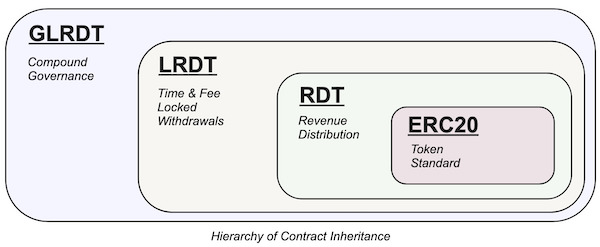
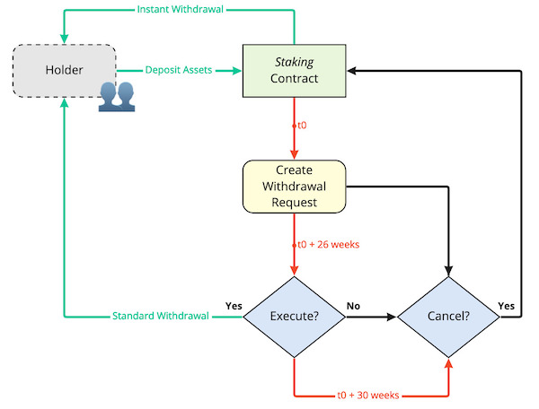

# (Governance) Locked Revenue Distribution Token

[](https://www.gnu.org/licenses/agpl-3.0)

LockedRevenueDistributionToken (LRDT) extends [Maple Lab's RevenueDistributionToken](https://github.com/maple-labs/revenue-distribution-token/tree/v1.0.1) (RDT) to add time-based and fee-based withdrawal mechanisms. This implements the [EIP-4626 Tokenized Vault Standard](https://eips.ethereum.org/EIPS/eip-4626) for composability with vault wrappers and aggregators.

GovernanceLockedRevenueDistributionToken (GLRDT) extends LockedRevenueDistributionToken to add Compound governance compatibility, using OpenZeppelin's [ERC20Votes](https://github.com/OpenZeppelin/openzeppelin-contracts/blob/v4.8.0-rc.1/contracts/token/ERC20/extensions/ERC20Votes.sol).

## Contracts



- [ERC20](https://github.com/maple-labs/erc20/tree/v1.0.0) implements the ERC-20 token standard and transfers.
  - [RevenueDistributionToken](https://github.com/maple-labs/revenue-distribution-token/tree/v1.0.1) implements reward distributions and the ERC-4626 vault standard.
    - [LockedRevenueDistributionToken](src/LockedRevenueDistributionToken.sol) implements time-restricted and fee-restricted withdrawals.
      - [GovernanceLockedRevenueDistributionToken](src/GovernanceLockedRevenueDistributionToken.sol) implements Compound-compatible governance voting.

It is possible to use LRDT without the governance properties of GLRDT by inheriting or deploying it directly.

## GovernanceLockedRevenueDistributionToken.sol

GLRDT extends LRDT and adds Compound governance via [ERC20Votes and ERC20VotesComp](https://docs.openzeppelin.com/contracts/4.x/api/token/erc20#ERC20VotesComp). This exactly matches Compound's interface, supporting a maximum supply of (2^96 - 1) `type(uint96).max` on deposited assets.

To account for rewards and allow for multi-chain voting the governance voting power is based on the amount of assets held in the vault rather than the number of shares, this means that rewards earned also apply to voting power. Checkpoints are managed by capturing both the amount of shares and the amount of assets (votes) upon each checkpoint and therefore voting power can be moved and re-delegated whenever the share token is minted, burned, or transferred since the amount of underlying assets will be calculated for the sum of delegated shares.

For multi-chain setups it is important to note that the vault share token cannot be bridged since underlying balances and conversion rate will not be equivalent, but since _governance voting power_ is based on the _underlying asset balance_ it holds that this can enable multi-chain governance strategies when the underlying asset is also bridged 1:1 between chains.

## LockedRevenueDistributionToken.sol

LRDT has been designed to be a foundation for governance tokens, which often requires time-locked commitments for the alignment of participants. Once a staker deposits into the vault, there are two possible withdrawal mechanisms:

1. Time-based 'Standard' withdrawals, not subject to a fee.
2. Fee-based 'Instant' withdrawals, available instantly.

This results in a system wherein participants must be subject to withdrawal conditions thereby demonstrating a longer term horizon and commitment to the protocol.



### Standard Withdrawals

To start a time-based 'standard' withdrawal, a staker must first create a withdrawal request by calling `createWithdrawalRequest` with the number of shares that they wish to redeem in future. This transaction will calculate the amount of underlying assets (deposited + rewarded) available to the staker at the point when the transaction is executed along with an unlockedAt timestamp for when the withdrawal is executable. Creating a withdrawal request transfers these shares to the vault contract and will no longer be part of the staker's balance or voting power. Multiple withdrawal requests are possible, and each valid call of `createWithdrawalRequest` will push a new request into the array.

Cancelling a withdrawal request can be done by calling `cancelWithdrawalRequest` with the position of the withdrawal request to be cancelled. Shares are returned to the staker at the current rate of conversion, at the time of transaction execution, meaning the amount of shares returned will not include the rewards accrued on the underlying assets. Stakers should expect the same number of assets to be returned to their staking balance but a lower number of shares. The difference in shares earned will be burned by the contract and the redeemed assets will remain on the contract for distribution on the next vesting schedule cycle.

To execute the withdrawal the staker can call `executeWithdrawalRequest` to burn their vault shares in return for the assets recorded in the withdrawal request. Withdrawal requests should only be created when the staker intends to withdraw and to prevent them from being open indefinitely a `WITHDRAWAL_WINDOW` has been introduced to ensure stakers execute this withdrawal request within a certain time-frame.

No fee on the returned assets is applied when using a time-based withdrawal after the `unlockedAt` timestamp, if executed before unlock a percentage of the instant withdrawal fee will be taken depending on the elapsed time of the withdrawal request. `previewWithdrawalRequest` will return the withdrawal request alongside the expected assets returned and the fee to be paid.

### Instant Withdrawals

Also sometimes known as a 'rage quit', this applies a fee penalty to stakers that wish to have instant access to their underlying assets. For composability with the ERC-4626 standard this fee penalty is applied by default to the `previewRedeem`, `redeem`, `previewWithdraw`, and `withdraw` functions and would be applied when called by any vault wrappers. The fee can be set as a percentage using the owner `setInstantWithdrawalFee` function.

It is possible to exempt certain vault share token owners from the instant withdrawal fee and this may be used to exempt a particular third-party vault or future migration contract, an example of this would be to exempt a lending vault from the fee so that liquidations can take place without subjecting the original holder to a lower liquidation price. Exemption addresses can only be set by the contract `owner`.

The ERC-4626 standard does not offer functions for previewing a redeem or withdraw for a particular account, as is the case when an exemption has been set. Two new functions, `previewRedeem(uint256 shares_, address owner_)` and `function previewWithdraw(uint256 assets_, address owner_)` have been added to facilitate account-specific withdrawal estimations and will also return the `fee_` paid as the second return parameter. To meet the standard, `previewRedeem(uint256 shares_)` and `previewWithdraw(uint256 assets_)` will always apply the fee and the fee-paid will not be available within the return.

### Public Vesting Schedule Updating

Reward distribution can be made fully autonomous using keepers by calling the public `updateVestingSchedule` function. To prevent any abuse this uses a fixed vesting period and cannot be called again until the last day of the vesting cycle and without this protection then it would be possible to frequently call the `updateVestingSchedule` function to extend the reward distribution time far beyond the fixed period. It is important to note that the owner-protected `updateVestingSchedule` from RDT is still present and calling this with a vesting period longer than defined in the public function will prevent the public function being called until the last day of the vesting period.

## Developing

### Setup

```
git clone git@github.com:GETProtocolDAO/locked-revenue-distribution-token.git
cd locked-revenue-distribution-token
forge install
```

### Testing

```
forge test
```

This project was built using [Foundry](https://github.com/foundry-rs/foundry).

### Deployment & Verification

The included [Makefile](/Makefile) can be used to deploy either LRDT or GLRDT using the `deploy-lrdt` and `deploy-glrdt` commands using [forge create](https://book.getfoundry.sh/reference/forge/forge-create).

The following defaults are set and can be overridden by passing parameters to the make command:

- CHAIN_ID=1
- PRECISION=`type(uint96).max`=`2^96 - 1`
- INSTANT_WITHDRAWAL_FEE=15
- LOCK_TIME_WEEKS=26

FROM & PRIVATE_KEY have been set to Anvil account 0 defaults. Ensure to provide a new secured key for production deployments.

Deployment & verification can be ran with:

```
ETHERSCAN_API_KEY=<key> make deploy-glrdt NAME="xASSET" RPC_URL="<url>" FROM="<address>" PRIVATE_KEY="<key>" SYMBOL="xASSET" OWNER="<address>" ASSET="<address>" INSTANT_WITHDRAWAL_FEE="<0-99,integer>" LOCK_TIME_WEEKS"<integer>"
```

### Static Analysis

[Slither](https://github.com/crytic/slither) and [Mythril](https://github.com/ConsenSys/mythril) have been configured to be ran with `make` using their official Docker containers. These can be ran with `make slither` and `make myth`.

## About GET Protocol DAO


The GET Protocol DAO exists to support the NFT ticketing products, blockchain operations, and the broader [GET Protocol](https://www.get-protocol.io/) ecosystem through marketing, outreach, and software development. GET Protocol exists to bring transparency, honesty, and the power of Web3 to event ticketing. For further technical documentation on protocol specification and usage, please see the [Documentation Hub](https://docs.get-protocol.io/)
